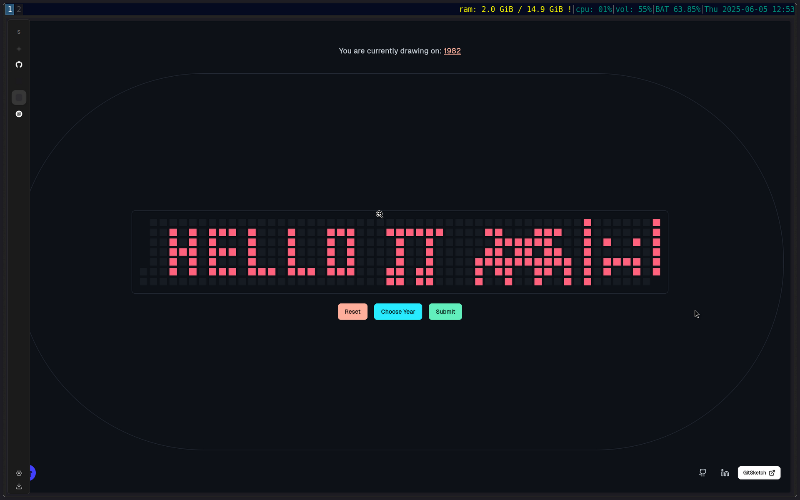
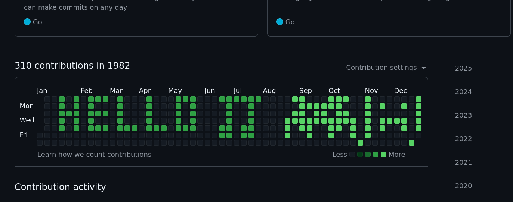

# ✨ GitSketch

Release your inner picasso on a 7x52 canvas. 

---

## 🧠 What is GitSketch?

`GitSketch` lets you **draw** on a GitHub contribution grid and then turns your strokes into real Git commits — manipulating commit dates to match your art.

---

## 🚀 Quick Start

### 🛠 Requirements

- Git installed
- A Git repo (can be a forked dummy repo)
- Rust (Preferrably) but a binary also exists in `/bin/git_sketch`

---

### 1. Clone This Repo

```bash
git clone https://github.com/PS-Wizard/GitSketch.git
cd GitSketch
```

### 2. Run the backend:
```
~

[wizard@archlinux GitSketch]$ cargo run
   Compiling git_sketch v0.1.0 (/home/wizard/GitSketch)
    Finished `dev` profile [unoptimized + debuginfo] target(s) in 0.41s
     Running `target/debug/git_sketch`
GitSketch: Up And Running at :8080
^C

// Or
[wizard@archlinux GitSketch]$ ./bin/git_sketch
GitSketch: Up And Running at :8080

```

### 3. Open Drawing UI:

It's a simple html page, open it with your browser: `./frontend/index.html`

### 4. Draw: 
- Enter a year 
- Click + drag to fill the grid
- Hit **Submit**; and it'll send the dates to the backend.


### 5. Backend Will:
```
~ For Each Date:
GIT_AUTHOR_DATE="YYYY-MM-DDT12:00:00" \
GIT_COMMITTER_DATE="YYYY-MM-DDT12:00:00" \
git commit --allow-empty -m "PS-Wizard" 
```

### 6. Push it
```
~

[wizard@archlinux GitSketch]$ git push origin main

```

# ⚠️ Notes
- Make sure you're inside a valid Git repository.
- This tool will make empty commits on the selected dates.
- You can fork a repo or use a fresh one for this.

# Why?
Because you can; and also cause it's kinda cool.

# Screenshot:




